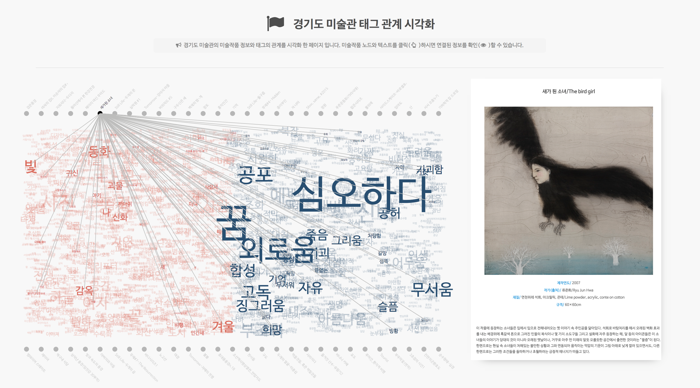

# Museum Tag Data Visualisation

The repository contains all front-end code for research paper; 
[*A  Study  on  Collaborative  Tagging  Visualization  of  Artworks  and  Tags  in  Online  Museum: Focusing on Tags of Gyeonggi  Museum  of  Modern  Art*](www.google.com) by [Soim.H.](https://www.linkedin.com/in/soim-hur-137b3283/) & Yongjun.S.


### Abstract
This study suggests a data visualization that connects the relationship of the tags accumulated by collaborative tagging of artworks in [Gyeonggi Museum of Modern Art (GMOMA)](https://gmoma.ggcf.kr) in order to effectively display massive tags and artworks at interface. Considering the specificity of the artworks, the meaning of data was classified according to the perspectives of visitors that appreciate artworks. As a result of user test, the time for searching data is significantly shorter than that of prior GMOMA's environments and users evaluated the visualization is quite useful tool.


### Methods
1. **Data collecting** : gathered tags and artworks meta data through web crawling from [GMOMA's collection page](https://gmoma.ggcf.kr/archives/artworks/collection).
2. **Data scrubbing** : removed tags in typographical errors and corrected values against a known list of entities through R program and Excel
3. **Data analysis** : analyzed context of artworks under GMOMA's collection page environments
4. **Data visualisation** : visualized networks of data set (nodes of tag and artwork) with [D3.js ](https://d3js.org/) libraries on HTML documents

### Results
* **Basic layout**


<br />

* **When user clicks tag nodes**


<br />

* **When user clicks artwork nodes**




<br />

### How to see on your computer

* Clone this repo

```git clone https://github.com/soimhur/museum-tag-visualization.git```

* Go to the folder

```cd museum-tag-visualization```

* Make python server active on your local computer

```python -m SimpleHTTPServer 8888```

